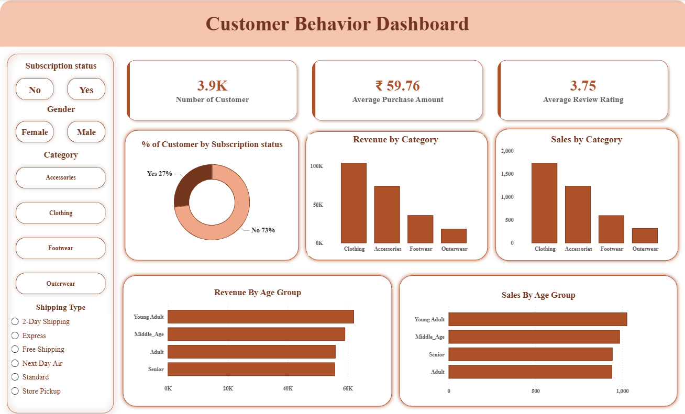

# 🛒 Customer Shopping Behavior Analysis

## 📖 Overview

This project analyzes customer shopping behavior to uncover purchasing patterns, customer preferences, spending habits, and subscription trends. 
The analysis includes data cleaning, feature engineering, SQL-based business insights, PostgreSQL integration, and an interactive Power BI dashboard.

---

## 🎯 Project Goals

- Clean and preprocess customer shopping data.
- Handle missing values efficiently.
- Create meaningful features for analysis.
- Store processed data in PostgreSQL.
- Perform business analysis using SQL.
- Visualize insights with Power BI.

---

## 🛠️ Technologies Used

- Python
- Pandas
- PostgreSQL
- SQLAlchemy
- Psycopg2
- SQL
- Power BI
- Jupyter Notebook

---

## 📂 Project Structure

```text
Customer_Shopping_Behavior/
│
├── customer_shopping_behavior.csv
├── customer_shopping_behavior.ipynb
├── Customer_shop_behave_sql_queries.sql
├── Customer_behavior_dashboard.pbix
├── interview_que_on_dataset.pdf
└── README.md
```

---

## 🔧 Data Preprocessing

### Missing Value Handling

Filled missing values in the `Review Rating` column using the median rating of each product category.

```python
df["Review Rating"] = df.groupby("Category")["Review Rating"]\
.transform(lambda x: x.fillna(x.median()))
```

### Column Standardization

- Converted column names to lowercase.
- Replaced spaces with underscores.
- Renamed columns for consistency.

### Feature Engineering

#### Age Group Classification

Created customer age segments:

- Young Adult
- Adult
- Middle Age
- Senior

#### Purchase Frequency Conversion

Converted purchase frequency categories into numerical days for analysis.

| Frequency | Days |
|------------|------|
| Weekly | 7 |
| Fortnightly | 14 |
| Bi-Weekly | 14 |
| Monthly | 30 |
| Quarterly | 90 |
| Every 3 Months | 90 |
| Annually | 365 |

---

## 🗄️ PostgreSQL Integration

The cleaned dataset was loaded into PostgreSQL for advanced querying and analysis.

### Required Libraries

```bash
pip install psycopg2-binary sqlalchemy
```

---

## 📊 SQL Analysis

Business insights were generated using SQL queries such as:

- Customer count by subscription status
- Revenue analysis
- Average spending patterns
- Customer segmentation
- Purchase behavior analysis

Example Query:

```sql
SELECT
    subscription_status,
    COUNT(customer_id) AS total_customer,
    ROUND(AVG(purchase_amount),2) AS avg_spend,
    ROUND(SUM(purchase_amount),2) AS total_revenue
FROM customer
GROUP BY subscription_status
ORDER BY total_revenue DESC;
```

---

## 📈 Power BI Dashboard

The dashboard provides insights into:

- Total Revenue
- Customer Demographics
- Purchase Frequency Analysis
- Category-wise Sales
- Subscription Status Analysis
- Customer Spending Behavior
- Review Rating Trends

---
<h2>📊 Dashboard Preview</h2>

<p align="center">
  
</p>

## 🔍 Key Insights

- Identified high-value customer segments.
- Compared spending behavior of subscribed and non-subscribed customers.
- Analyzed category-wise purchasing trends.
- Explored customer review patterns.
- Measured the impact of purchase frequency on revenue.

---

## 🚀 How to Run

### Clone the Repository

```bash
git clone https://github.com/your-username/Customer_Shopping_Behavior.git
```

### Install Dependencies

```bash
pip install pandas sqlalchemy psycopg2-binary
```

### Run Jupyter Notebook

```bash
jupyter notebook
```

### Connect to PostgreSQL

Update your database credentials and execute the notebook cells.

### Open Power BI Dashboard

Open:

```text
Customer_behavior_dashboard.pbix
```

using Power BI Desktop.

---

## 📚 Skills Demonstrated

- Data Cleaning
- Feature Engineering
- Exploratory Data Analysis (EDA)
- PostgreSQL
- SQL Query Writing
- Power BI Dashboard Development
- Business Insights Generation

---


---

⭐ If you found this project helpful, consider giving it a star!
